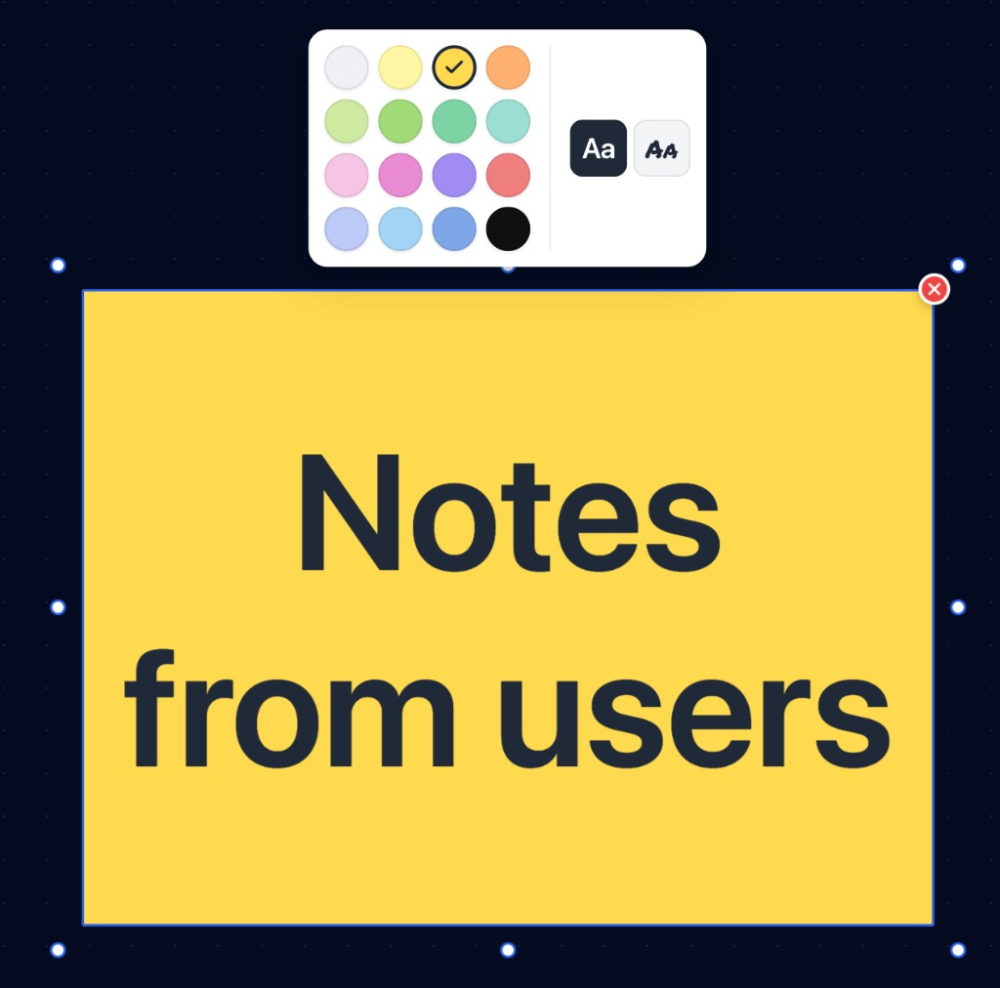

# archon-note

[](LICENSE)
[](package.json)
[](https://archon.su)
[](https://surecom.in/api/plugins/archon-note/meta)

[](https://github.com/Surecom/archon-note/pulls)
[](https://archon.su)
[](https://www.codefactor.io/repository/github/surecom/archon-note)
[](https://snyk.io/test/github/Surecom/archon-note)
[](https://libraries.io/github/Surecom/archon-note)

Sticky-note overlay for the [ArchON](https://archon.su) canvas. Public plugin. Authored from scratch.

> **Looking for the architecture or full spec?** Everything is in the [`docs/`](docs/) folder of this repository — `ARCHITECTURE.md`, `DATA_MODEL.md`, `HOST_CONTRACT.md`, `UI_SPEC.md`. Each file covers one concern (state machine, data shape, host API contract, visual spec) so you can read just the part you need without scanning the whole source tree.

## Screenshot

A selected note inside the ArchON canvas with the styling popup open — 16-color palette, `Sans Serif` / `Permanent Marker` font toggle, red-circle delete button on the top-right corner, blue resize handles 15 px outside the note edge:



## What it does

- Click the plugin icon → a sticky note drops in the center of the viewport.
- Single-click a note → it's selected (resize grid extends 15 px past every edge, delete X at top-right, small Palette button above the resize grid).
- Click the Palette button → smart-positioned styling popup opens (16 colors + `Aa`/`Aa` font toggle). Stays inside the canvas viewport, prefers placements that don't cover the note text.
- Double-click a note → edit mode (textarea focused, dynamic font sizing, caret centered).
- Drag the note body to move; drag a resize handle to resize.
- Click outside → deselect / commit text. ESC also deselects.
- `Delete` / `Backspace` while selected → delete the note (skipped if focus is in any input).
- All actions are undo-able with global `Cmd+Z`.
- Notes persist with the project (localStorage, JSON export, Google Drive).
- **Notes are scoped to integration layers** — each note belongs to the layer it was created on, and is hidden when the user switches to a different layer. The `layerId` is part of the persisted note schema.
- **Remove confirmation** — when the user attempts to remove the plugin from the project, the host shows a `ConfirmModal` listing how many notes live on each integration layer; removal (and deletion of all notes) only proceeds on confirm. No notes in the project → silent removal, no modal.

## Performance

- **Zero-lag camera follow.** Each note runs its own `requestAnimationFrame` loop that reads the current viewport synchronously and mutates DOM directly via refs (no React re-renders for camera changes). Notes update in the SAME frame as the canvas — no perceptible drag during pan / zoom.
- **GPU-accelerated movement** via `transform: translate3d(...)` + `willChange: 'transform'`.
- **Wheel forwarding.** A non-passive `wheel` listener on each note re-dispatches the event to the host canvas so panning continues smoothly when the cursor crosses a note.

## Build

```bash
cd archon-note
npm install
npm run build           # → build/index.js + build/style.css
npm run package         # → build/archon-note.zip + bumps version
```

That's the whole local pipeline. The packaged ZIP can be uploaded to any compatible plugin marketplace.

## How it integrates with the host

`displayMode: 'canvas-overlay'`. The host auto-mounts the plugin into a dedicated `<div>` layered above the canvas as soon as the script registers — no host modal/window. Clicks on the plugin icon (anywhere the host surfaces it) dispatch `onIconClick(api)` instead of opening any host UI. See [`docs/HOST_CONTRACT.md`](docs/HOST_CONTRACT.md) for the exact API methods the plugin uses.

## Documentation map

| File | Read when… |
|------|-----------|
| [docs/ARCHITECTURE.md](docs/ARCHITECTURE.md) | You're changing the state machine (idle/selected/editing), drag/resize logic, viewport math, fitText, undo strategy, drawing/view-mode behavior, the rAF loop, or wheel forwarding. |
| [docs/DATA_MODEL.md](docs/DATA_MODEL.md) | You're changing the `ArchonNote` shape, the `pluginData` slot layout, font-family enum, or anything that touches save/load. |
| [docs/HOST_CONTRACT.md](docs/HOST_CONTRACT.md) | You need to know which host API methods the plugin depends on (and how to keep working on hosts that don't yet implement the optional ones). |
| [docs/UI_SPEC.md](docs/UI_SPEC.md) | You're tweaking colors, fonts, sizes, padding, popup positioning, the styling button, or any visual concern. |

## Critical invariants (do not break)

1. Notes live in `installedPlugins['archon-note'].pluginData`, **never** in top-level `ProjectState`.
2. Mutations always go through `api.applyPluginDataDelta(...)` so they participate in global Cmd+Z. **Never** use `setPluginData` for partial updates — it replaces the whole slot and is NOT undo-able.
3. Plugin auto-mounts via `mountOverlay`; clicking the icon triggers `onIconClick` (no host modal).
4. View mode → no mutations of any kind. Drawing mode → opacity 0.55 + pointer-events disabled on overlay root.
5. Single click = select; double-click = edit; pointer-move > 5 px = drag (Miro-like dispatch).
6. Viewport-driven DOM mutations (`transform`, `width`, `height`, `padding`, `font-size`, textarea height, popup position) live in the per-note rAF loop. **No `viewport` React state** — that path produces a 1-frame lag behind the canvas.

## License

[MIT](LICENSE) © Surecom — code in this folder is original.
